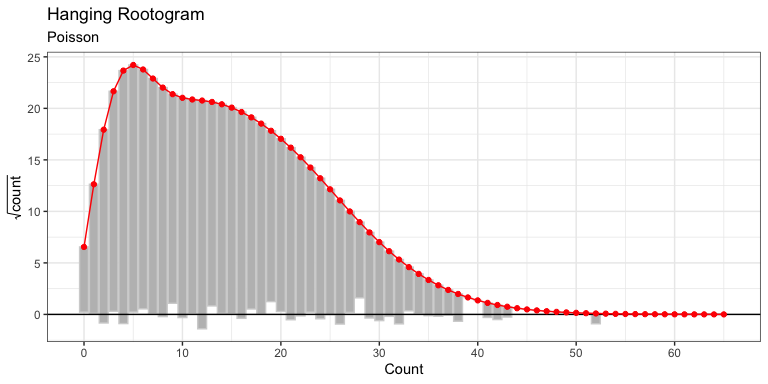

<!-- README.md is generated from README.Rmd. Please edit that file -->

# networkscaleup

<!-- badges: start -->

[](https://github.com/ilaga/networkscaleup/actions/workflows/R-CMD-check.yaml)
<!-- badges: end -->

The `networkscaleup` package provides a suite of functions to both fit
and diagnose the fit of several popular models for Aggregated Relational
Data (ARD). These models are fit using Stan (`RStan`) and `glmmTMB`.
There is also additional functionality available to fit these models
using `cmdstan`.

## Installation

`networkscaleup` can be installed from CRAN with

``` r
install.packages("networkscaleup)
```

You can install the development version of `networkscaleup` from
[GitHub](https://github.com/) with:

``` r
# install.packages("pak")
pak::pak("ilaga/networkscaleup")
```

## Installation to use cmdstanR functionality

We have created a version of this package which can use `cmdstanR`. To
install this version from Github use

``` r
remotes::install_github("ilaga/networkscaleup@dev-cmdstan", type = "source")
```

This requires an installation of `cmdstanR`. See
[here](https://mc-stan.org/cmdstanr/) for details.

## Simulating Data

The `networkscaleup` package allows simulation of synthetic ARD from
commonly used models.

``` r
## simulate some simple data
library(networkscaleup)

set.seed(2)
sim_dat <- make_ard(family = "poisson")
```

We can then fit the (true) model to this data and evaluate the fit of
this model. Several diagnostics are provided, including rootograms and
residual computation.

``` r
pois_fit_list <- fit_mle(sim_dat$ard, family = "poisson")

pois_root <- hang_rootogram_ard(
  ard = sim_dat$ard,
  model_fit = pois_fit_list
)

pois_root
```



We see that the hanging rootogram indicates good fit, as would be
expected. More flexible models and additional model checking diagnostics
are also available.

<!-- ## Example -->

<!-- This is a basic example which shows you how to solve a common problem: -->

<!-- ```{r example} -->

<!-- library(networkscaleup) -->

<!-- ## basic example code -->

<!-- ``` -->

<!-- What is special about using `README.Rmd` instead of just `README.md`? You can include R chunks like so: -->

<!-- ```{r cars} -->

<!-- summary(cars) -->

<!-- ``` -->

<!-- You'll still need to render `README.Rmd` regularly, to keep `README.md` up-to-date. `devtools::build_readme()` is handy for this. -->

<!-- You can also embed plots, for example: -->

<!-- ```{r pressure, echo = FALSE} -->

<!-- plot(pressure) -->

<!-- ``` -->

<!-- In that case, don't forget to commit and push the resulting figure files, so they display on GitHub and CRAN. -->
