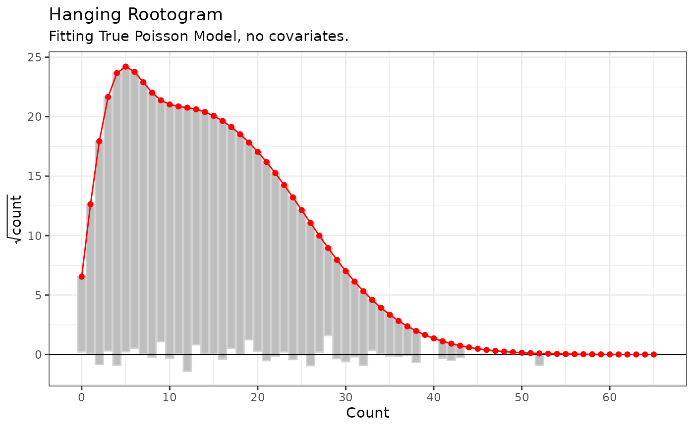
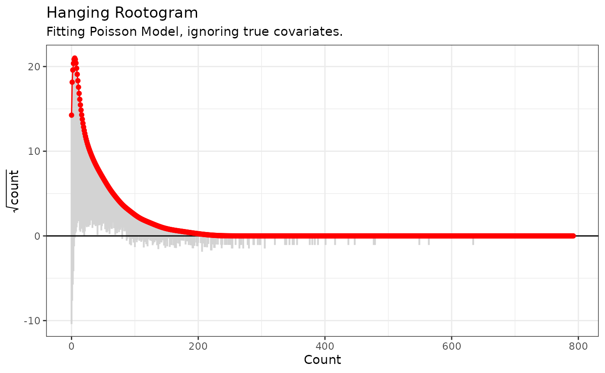
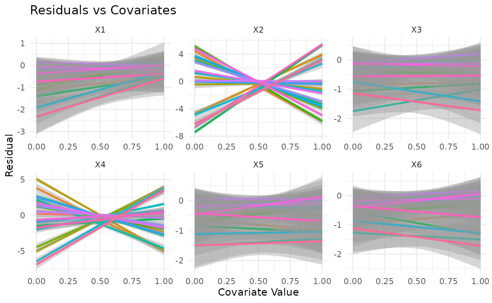
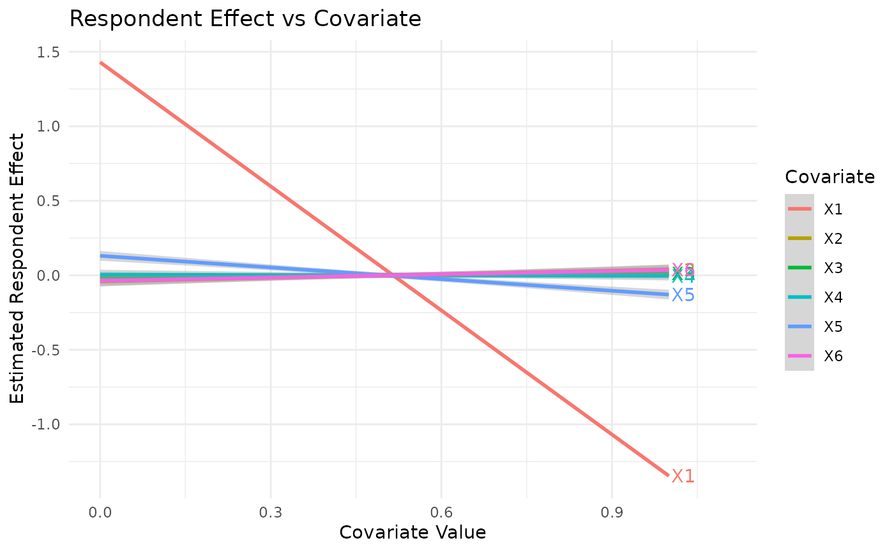

# Diagnostic tools for ARD Models

``` r

library(networkscaleup)
library(ggplot2)
```

This vignette provides a brief introduction to some of the tools
available in `networkscaleup` for assessing the fit of common ARD models
to simulated data.

## Simulating Data

We first simulate two datasets from the classical Poisson ARD model, one
with no covariate information and one with covariates.

``` r

set.seed(2)
sim_dat_1 <- make_ard(family = "poisson")
sim_dat_2 <- make_ard(
  p = 6,
  p_local_nonzero = 2,
  p_global_nonzero = 1,
  family = "poisson"
)
```

We will then examine the impact of this covariate structure and the
choice of model fit using our diagnostics.

## Hanging Rootograms

We first fit a Poisson model to both of these simulated examples,
ignoring the covariate information. We see that for the simple model,
with no covariate structure, the rootogram indicates good fit.

``` r

pois_fit_list_1 <- fit_mle(sim_dat_1$ard, family = "poisson")

pois_root_1 <- hang_rootogram_ard(
  ard = sim_dat_1$ard,
  model_fit = pois_fit_list_1
)

pois_root_1 + labs(subtitle = "Fitting True Poisson Model, no covariates.")
```



We can also fit this model to the data which has true covariate
structure, which is ignored. The rootogram captures this lack of model
fit.

``` r

pois_fit_list_2 <- fit_mle(sim_dat_2$ard, family = "poisson")

pois_root_2 <- hang_rootogram_ard(
  ard = sim_dat_2$ard,
  model_fit = pois_fit_list_2
)

pois_root_2 + labs(subtitle = "Fitting Poisson Model, ignoring true covariates.")
```



## Testing for Covariates

We can also use our tests to identify the impact of group level and
respondent level covariates for the simulated data with covariates. We
plot residuals for the fitted model against the values of each
covariate. These plots identify the true covariate structure present.

``` r

cov_p_list <- cov_plots(
  ard = sim_dat_2$ard,
  model_fit = pois_fit_list_2,
  x_cov = sim_dat_2$x_cov,
  se = T
)

local_cov_plot <- cov_p_list$Group_plot
global_cov_plot <- cov_p_list$Respondent_plot

local_cov_plot # Suggests x2 and x4
#> `geom_smooth()` using formula = 'y ~ x'
```



``` r

global_cov_plot # Suggests x1
#> `geom_smooth()` using formula = 'y ~ x'
```


