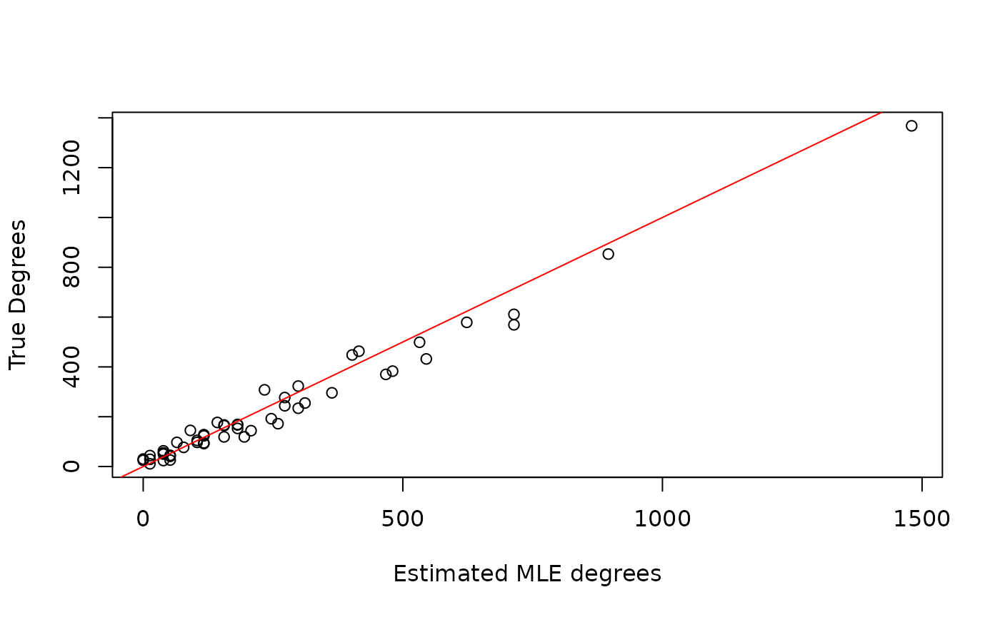
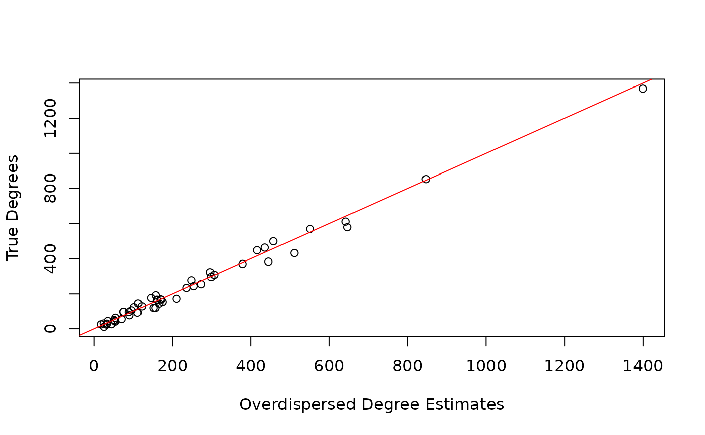
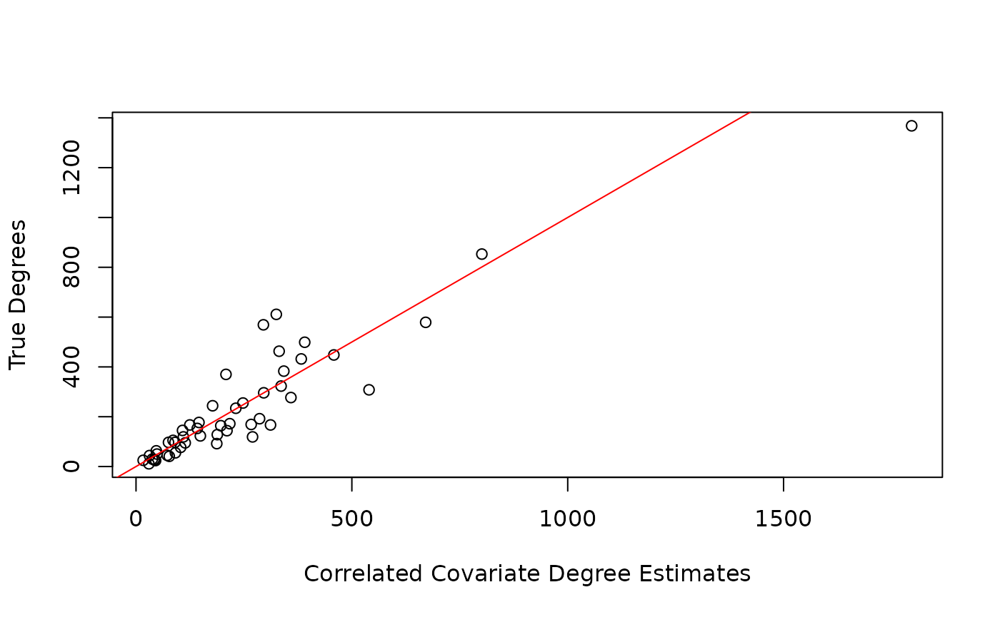

# Fitting Network Scale-up Models

## Overview

This packaged fits several different network scale-up models (NSUM) to
Aggregated Relational Data (ARD). ARD represents survey responses about
how many people each respondents knows in different subpopulations
through “How many X’s do you know?” questions. Specifically, if $`N_i`$
respondents are asked how many people they know in $`N_k`$
subpopulations, then ARD is an $`N_i`$ by $`N_k`$ matrix, where the
$`(i,j)`$ element represents how many people respondent $`i`$ reports
knowing in subpopulation $`j`$. NSUM leverages these responses to
estimate the unknown size of hard-to-reach populations. See Laga, et
al. (2021) for a more details.

In this package, we provide functions to estimate the size and
accompanying parameters (e.g. degrees) from 4 papers:

- Killworth, P. D., Johnsen, E. C., McCarty, C., Shelley, G. A., and
  Bernard, H. R. (1998) plug-in MLE
- Killworth, P. D., McCarty, C., Bernard, H. R., Shelley, G. A., and
  Johnsen, E. C. (1998) MLE
- Zheng, T., Salganik, M. J., and Gelman, A. (2006) overdispersed model
- Laga, I., Bao, L., and Niu, X (2021) uncorrelated, correlated, and
  covariate models

This vignette introduces each model and shows how to fit all of these
models on one data set.

## Instructions

First, load the library:

``` r

library(networkscaleup)
```

We will simulate a data set from the Binomial formulation in Killworth,
P. D., Johnsen, E. C., McCarty, C., Shelley, G. A., and Bernard, H. R.
(1998).

``` r

set.seed(1998)
N_i <- 50
N_k <- 5
N <- 1e5
sizes <- rbinom(N_k, N, prob = runif(N_k, min = 0.01, max = 0.15))
degrees <- round(exp(rnorm(N_i, mean = 5, sd = 1)))

ard <- matrix(NA, nrow = N_i, ncol = N_k)
for (k in 1:N_k) {
  ard[, k] <- rbinom(N_i, degrees, sizes[k] / N)
}

## Create some artificial covariates for use later
x <- matrix(sample(1:5, size = N_i * N_k, replace = T),
  nrow = N_i,
  ncol = N_k
)
z <- cbind(rbinom(N_i, 1, 0.3), rnorm(N_i), rnorm(N_i), rnorm(N_i))
```

We should also prepare the data for modeling by scaling all covariates
to have standard deviation 1 and mean 0. Additionally, we need to define
which columns of $`Z`$ belong to $`z_{subpop}`$ and $`z_{global}`$.

``` r

x <- scale(x)
z <- scale(z)
z_subpop <- z[, 1:2]
z_global <- z[, 3:4]
```

### PIMLE

The plug-in MLE estimator from Killworth, P. D., Johnsen, E. C.,
McCarty, C., Shelley, G. A., and Bernard, H. R. (1998) is a two-stage
estimator that first estimates the degrees for each respondent $`d_i`$
by maximizing the following likelihood for each respondent:
``` math
\begin{equation}
  L(d_i;y, \{N_k\}) = \prod_{k=1}^L \binom{d_i}{y_{ik}} \left(\frac{N_k}{N} \right)^{y_{ik}} \left(1 - \frac{N_k}{N} \right)^{d_i - y_{ik}},
\end{equation}
```
where $`L`$ is the number of subpopulations with known $`N_k`$. For the
second stage, the model plugs in the estimated $`d_i`$ into the equation
``` math
\begin{equation}
 \frac{y_{ik}}{d_i} = \frac{N_k}{N}
\end{equation}
```
and solves for the unknown $`N_k`$ for each respondent. These values are
then averaged to obtain a single estimate of $`N_k`$.

To summarize, stage 1 estimates $`\hat{d}_i`$ by
``` math
\begin{equation}
  \hat{d}_i = N \cdot \frac{\sum_{k=1}^L y_{ik}}{\sum_{k=1}^L N_k}
\end{equation}
```
and then these estimates are used in stage 2 to estimate the unknown
$`\hat{N}_k`$ by
``` math
\begin{equation}
  \hat{N}_k^{PIMLE} = \frac{N}{n} \sum_{i=1}^n \frac{y_{ik}}{\hat{d}_i}
\end{equation}
```

These estimates are obtained using the following call to the `killworth`
function.

``` r

pimle.est <- killworth(ard,
  known_sizes = sizes[c(1, 2, 4)],
  known_ind = c(1, 2, 4),
  N = N, model = "PIMLE"
)
#> Warning in killworth(ard, known_sizes = sizes[c(1, 2, 4)], known_ind = c(1, :
#> Estimated a 0 degree for at least one respondent. Ignoring response for PIMLE


plot(degrees ~ pimle.est$degrees, xlab = "Estimated PIMLE degrees", ylab = "True Degrees")
abline(0, 1, col = "red")
```


``` r


round(data.frame(
  true = sizes[c(3, 5)],
  pimle = pimle.est$sizes
))
#>    true pimle
#> 1  1817  1645
#> 2 14134 14632
```

Note that the function provides a warning saying that at least one
$`\hat{d}_i`$ was 0. This occurs when a respondent does not report
knowing anyone in the known subpopulations. This is an issue for the
PIMLE since a 0 value is in the denominator for $`\hat{N}_u^{PIMLE}`$.
Thus, we ignore the responses from respondents that correspond to
$`\hat{d}_i = 0`$.

### MLE

Next, we analyze the data from the Killworth, P. D., McCarty, C.,
Bernard, H. R., Shelley, G. A., and Johnsen, E. C. (1998) MLE estimator.
This is also a two-stage model, with an identical first stage, i.e.
``` math
\begin{equation}
  \hat{d}_i = N \cdot \frac{\sum_{k=1}^L y_{ik}}{\sum_{k=1}^L N_k}.
\end{equation}
```
However, the second stage estimates $`\hat{N}_k`$ by maximizing the
Binomial likelihood with respect to $`\hat{N}_k`$, fixing $`d_i`$ at the
estimated $`\hat{d}_i`$. Thus, the estimate for the unknown
subpopulation size is given by
``` math
\begin{equation}
  \hat{N}_k^{MLE} = N \cdot \frac{\sum_{i=1}^n y_{ik}}{\sum_{i=1}^n \hat{d}_i}.
\end{equation}
```

These estimates are also obtained using a single call to the `Killworth`
function.

``` r

mle.est <- killworth(ard,
  known_sizes = sizes[c(1, 2, 4)],
  known_ind = c(1, 2, 4),
  N = N, model = "MLE"
)


plot(degrees ~ mle.est$degrees, xlab = "Estimated MLE degrees", ylab = "True Degrees")
abline(0, 1, col = "red")
```



``` r


round(data.frame(
  true = sizes[c(3, 5)],
  pimle = mle.est$sizes
))
#>    true pimle
#> 1  1817  1526
#> 2 14134 12907
```

Note that there is no warning here since the denominator depends on the
summation of $`\hat{d}_i`$.

## Bayesian Models

Now we introduce the two Bayesian estimators implemented in this
package.

### Overdispersed Model

The overdispersed model proposed in Zheng et al. (2006) assumes the
following likelihood:
``` math
\begin{equation}
 y_{ik} \sim \text{negative-binomial}(\text{mean} = e^{\alpha_i + \beta_k}, \text{overdispersion} = \omega_k)
\end{equation}
```
Please see the original manuscript for more details on the model
structure and priors.

This package fits this overdispersed model either via the
Gibbs-Metropolis algorithm provided in the original manuscript
(`overdispersed`) or via Stan (`overdispersedStan`). We suggest using
the Stan version since convergence and effective sample sizes are more
satisfactory in the Stan implementation, and does not require tuning
jumping scales for Metropolis updates.

In order to identity the $`\alpha_i`$ and $`\beta_k`$ as log-degrees and
log-prevalences, respectively, the overdispersed model requires scaling
the parameters. In order to scale the parameters, the user must supply
at least one subpopulation with known size and the column index
corresponding to that known size. Additionally, a two secondary groups
may be supplied which can adjust for differences in gender or other
binary group classifications. More details of the scaling procedure can
be found in the original manuscript.

Below we fit both the overdispersed and overdispersedStan
implementations to the ARD and compare estimates. Note that in practice,
both warmup and iter should be set to higher values.

``` r

overdisp_gibbs_metrop_est <- overdispersed(
  ard,
  known_sizes = sizes[c(1, 2, 4)],
  known_ind = c(1, 2, 4),
  G1_ind = 1,
  G2_ind = 2,
  B2_ind = 4,
  N = N,
  warmup = 500,
  iter = 1000,
  verbose = TRUE,
  init = "MLE"
)
#> Iteration: 100 / 1000 [10%]
#> Iteration: 200 / 1000 [20%]
#> Iteration: 300 / 1000 [30%]
#> Iteration: 400 / 1000 [40%]
#> Iteration: 500 / 1000 [50%]
#> Iteration: 600 / 1000 [60%]
#> Iteration: 700 / 1000 [70%]
#> Iteration: 800 / 1000 [80%]
#> Iteration: 900 / 1000 [90%]
#> Iteration: 1000 / 1000 [100%]

overdisp_stan <- overdispersedStan(
  ard,
  known_sizes = sizes[c(1, 2, 4)],
  known_ind = c(1, 2, 4),
  G1_ind = 1,
  G2_ind = 2,
  B2_ind = 4,
  N = N,
  chains = 2,
  cores = 2,
  warmup = 250,
  iter = 500,
)
#> Warning: Bulk Effective Samples Size (ESS) is too low, indicating posterior means and medians may be unreliable.
#> Running the chains for more iterations may help. See
#> https://mc-stan.org/misc/warnings.html#bulk-ess
#> Warning: Tail Effective Samples Size (ESS) is too low, indicating posterior variances and tail quantiles may be unreliable.
#> Running the chains for more iterations may help. See
#> https://mc-stan.org/misc/warnings.html#tail-ess


round(data.frame(
  true = sizes,
  gibbs_est = colMeans(overdisp_gibbs_metrop_est$sizes),
  stan_est = colMeans(overdisp_stan$sizes)
))
#>    true gibbs_est stan_est
#> 1  1555      1569     1611
#> 2  4683      3596     5172
#> 3  1817      2062     1653
#> 4  1465      1099     1510
#> 5 14134      9142    13872
#> s
#> Chain 2: 1000 transitions using 10 leapfrog steps per transition would take 1.28 seconds.
#> Chain 2: Adjust your expectations accordingly!
#> Chain 2: 
#> Chain 2: 
#> Chain 2: Iteration:   1 / 500 [  0%]  (Warmup)
#> Chain 1: Iteration: 100 / 500 [ 20%]  (Warmup)
#> Chain 2: Iteration: 100 / 500 [ 20%]  (Warmup)
#> Chain 1: Iteration: 200 / 500 [ 40%]  (Warmup)
#> Chain 2: Iteration: 200 / 500 [ 40%]  (Warmup)
#> Chain 1: Iteration: 251 / 500 [ 50%]  (Sampling)
#> Chain 2: Iteration: 251 / 500 [ 50%]  (Sampling)
#> Chain 1: Iteration: 350 / 500 [ 70%]  (Sampling)
#> Chain 2: Iteration: 350 / 500 [ 70%]  (Sampling)
#> Chain 1: Iteration: 450 / 500 [ 90%]  (Sampling)
#> Chain 1: Iteration: 500 / 500 [100%]  (Sampling)
#> Chain 1: 
#> Chain 1:  Elapsed Time: 0.705 seconds (Warm-up)
#> Chain 1:                0.325 seconds (Sampling)
#> Chain 1:                1.03 seconds (Total)
#> Chain 1: 
#> Chain 2: Iteration: 450 / 500 [ 90%]  (Sampling)
#> Chain 2: Iteration: 500 / 500 [100%]  (Sampling)
#> Chain 2: 
#> Chain 2:  Elapsed Time: 0.792 seconds (Warm-up)
#> Chain 2:                0.427 seconds (Sampling)
#> Chain 2:                1.219 seconds (Total)
#> Chain 2:

plot(degrees ~ colMeans(overdisp_stan$degrees), xlab = "Overdispersed Degree Estimates", ylab = "True Degrees")
abline(0, 1, col = "red")
```



### Correlated Models

The correlated model proposed in Laga et al. (2022+) assumes the
following likelihood
``` math
\begin{equation}
    y_{ik} \sim Poisson\left(exp\left\{\delta_i + \rho_k + {\beta}_{global} {z}_{i,global} + {\beta}_{k,subpop} {z}_{i,subpop} + \alpha_k x_{ik} + b_{ik} \right\} \right),
\end{equation}
```
where critically,
``` math
\begin{equation}
  \mathbf{b}_i \sim \mathcal{N}_k\left({\mu}, \Sigma\right),
\end{equation}
```
i.e. the responses for each respondent are correlated across
subpopulations. Again, $`\delta_i`$ and $`\rho_k`$ need to be scaled,
and they can either be scaled using the same procedure as for the
overdispersed model (providing indices corresponding to different
groups), by using all known subpopulation sizes, or by weighting groups
according to their correlation with other groups. More details about
these scaling procedures are provided in Laga et al. (2022+).

In this package, model parameters are estimated via Stan. Note that
while the full model likelihood depends on $`{X}`$, $`{Z}_{global}`$,
and $`{Z}_{subpop}`$, any combination of these covariates can be
provided. Additionally, we can assume that $`\Sigma`$ is a diagonal
matrix (i.e. no correlation) by setting the argument
`model = uncorrelated` in the `correlatedStan` function.

``` r

correlated_cov_stan <- correlatedStan(
  ard,
  known_sizes = sizes[c(1, 2, 4)],
  known_ind = c(1, 2, 4),
  model = "correlated",
  scaling = "weighted",
  x = x,
  z_subpop = z_subpop,
  z_global = z_global,
  N = N,
  chains = 2,
  cores = 2,
  warmup = 250,
  iter = 500,
)
#> Warning: The largest R-hat is NA, indicating chains have not mixed.
#> Running the chains for more iterations may help. See
#> https://mc-stan.org/misc/warnings.html#r-hat
#> Warning: Bulk Effective Samples Size (ESS) is too low, indicating posterior means and medians may be unreliable.
#> Running the chains for more iterations may help. See
#> https://mc-stan.org/misc/warnings.html#bulk-ess
#> Warning: Tail Effective Samples Size (ESS) is too low, indicating posterior variances and tail quantiles may be unreliable.
#> Running the chains for more iterations may help. See
#> https://mc-stan.org/misc/warnings.html#tail-ess

correlated_nocov_stan <- correlatedStan(
  ard,
  known_sizes = sizes[c(1, 2, 4)],
  known_ind = c(1, 2, 4),
  model = "correlated",
  scaling = "all",
  N = N,
  chains = 2,
  cores = 2,
  warmup = 250,
  iter = 500,
)
#> l)
#> Chain 2:
#> Warning: The largest R-hat is NA, indicating chains have not mixed.
#> Running the chains for more iterations may help. See
#> https://mc-stan.org/misc/warnings.html#r-hat
#> Warning: Bulk Effective Samples Size (ESS) is too low, indicating posterior means and medians may be unreliable.
#> Running the chains for more iterations may help. See
#> https://mc-stan.org/misc/warnings.html#bulk-ess
#> Warning: Tail Effective Samples Size (ESS) is too low, indicating posterior variances and tail quantiles may be unreliable.
#> Running the chains for more iterations may help. See
#> https://mc-stan.org/misc/warnings.html#tail-ess


uncorrelated_cov_stan <- correlatedStan(
  ard,
  known_sizes = sizes[c(1, 2, 4)],
  known_ind = c(1, 2, 4),
  model = "uncorrelated",
  scaling = "all",
  x = x,
  z_subpop = z_subpop,
  z_global = z_global,
  N = N,
  chains = 2,
  cores = 2,
  warmup = 250,
  iter = 500,
)
#> Warning: The largest R-hat is 1.09, indicating chains have not mixed.
#> Running the chains for more iterations may help. See
#> https://mc-stan.org/misc/warnings.html#r-hat
#> Warning: Bulk Effective Samples Size (ESS) is too low, indicating posterior means and medians may be unreliable.
#> Running the chains for more iterations may help. See
#> https://mc-stan.org/misc/warnings.html#bulk-ess
#> Warning: Tail Effective Samples Size (ESS) is too low, indicating posterior variances and tail quantiles may be unreliable.
#> Running the chains for more iterations may help. See
#> https://mc-stan.org/misc/warnings.html#tail-ess

uncorrelated_x_stan <- correlatedStan(
  ard,
  known_sizes = sizes[c(1, 2, 4)],
  known_ind = c(1, 2, 4),
  model = "uncorrelated",
  scaling = "all",
  x = x,
  N = N,
  chains = 2,
  cores = 2,
  warmup = 250,
  iter = 500,
)
#> (Sampling)
#> Chain 1:                2.948 seconds (Total)
#> Chain 1: 
#> Chain 2: Iteration: 500 / 500 [100%]  (Sampling)
#> Chain 2: 
#> Chain 2:  Elapsed Time: 2.167 seconds (Warm-up)
#> Chain 2:                0.803 seconds (Sampling)
#> Chain 2:                2.97 seconds (Total)
#> Chain 2:
#> Warning: Bulk Effective Samples Size (ESS) is too low, indicating posterior means and medians may be unreliable.
#> Running the chains for more iterations may help. See
#> https://mc-stan.org/misc/warnings.html#bulk-ess
#> Warning: Tail Effective Samples Size (ESS) is too low, indicating posterior variances and tail quantiles may be unreliable.
#> Running the chains for more iterations may help. See
#> https://mc-stan.org/misc/warnings.html#tail-ess


round(data.frame(
  true = sizes,
  corr_cov_est = colMeans(correlated_cov_stan$sizes),
  corr_nocov_est = colMeans(correlated_nocov_stan$sizes),
  uncorr_cov_est = colMeans(uncorrelated_cov_stan$sizes),
  uncorr_x_est = colMeans(uncorrelated_x_stan$sizes)
))

plot(degrees ~ colMeans(correlated_cov_stan$degrees), xlab = "Correlated Covariate Degree Estimates", ylab = "True Degrees")
abline(0, 1, col = "red")
```



``` r


## Examine parameter estimates
colMeans(correlated_cov_stan$alpha)
colMeans(correlated_cov_stan$beta_global)
colMeans(correlated_cov_stan$beta_subpop)
```
